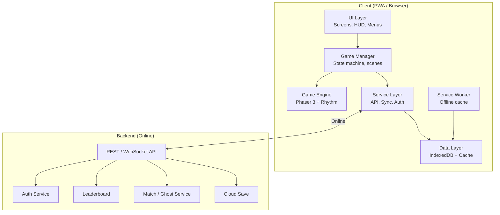
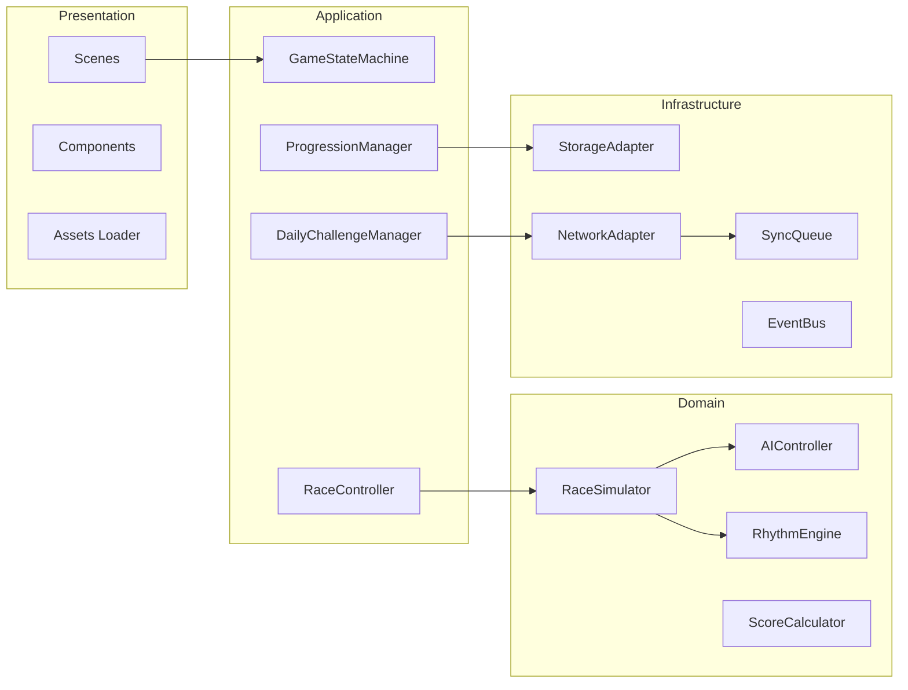
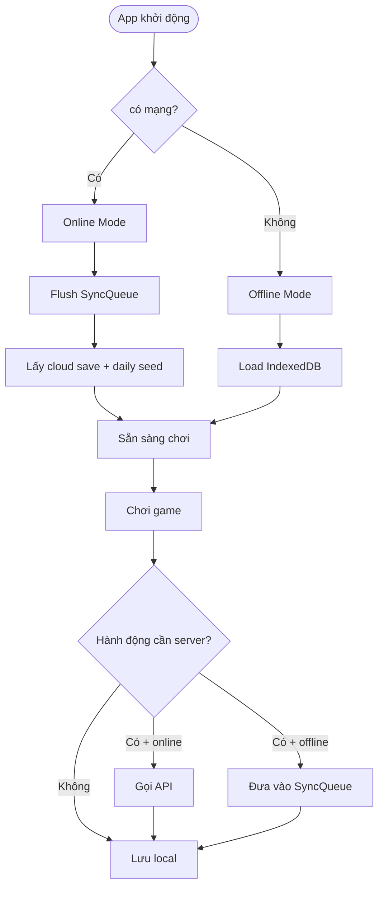
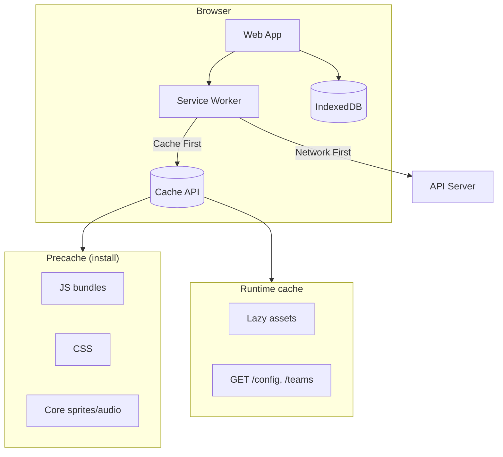
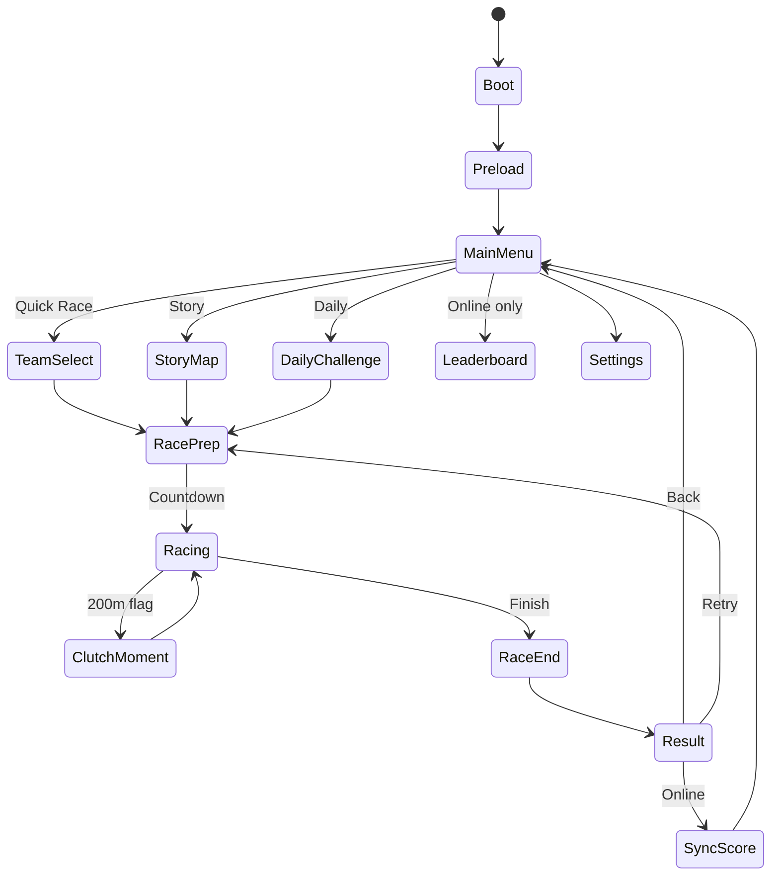
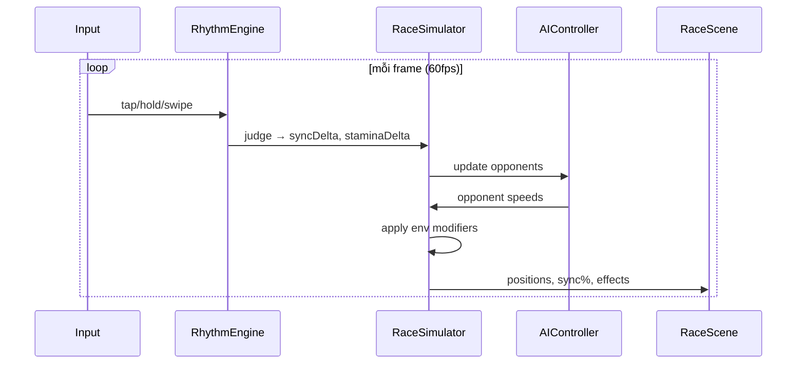
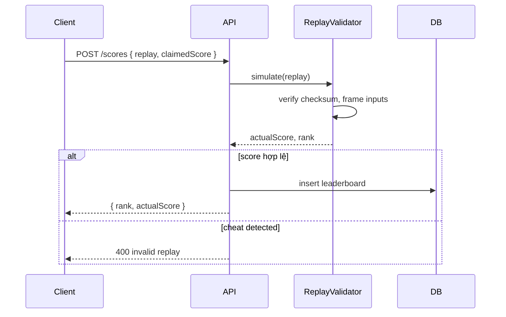
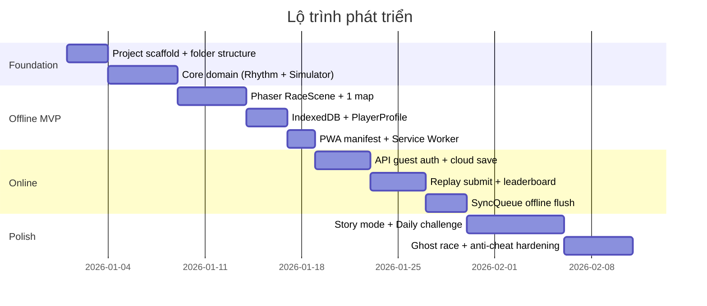
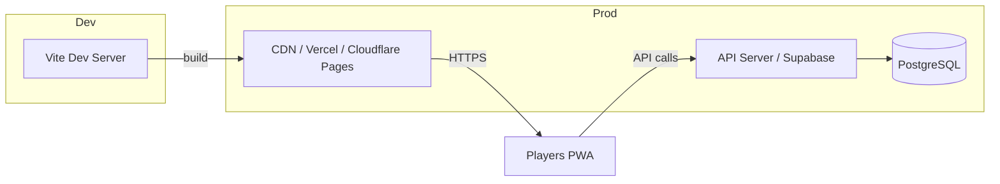
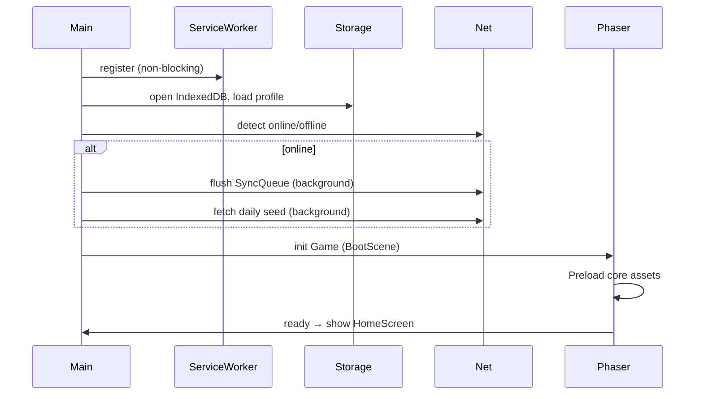

# Kiến trúc kỹ thuật: **Ngo Boat Race H5** (Online + Offline PWA)

Tài liệu **blueprint hoàn chỉnh** trước khi code — kiến trúc layer, module, data flow, online/offline, boot sequence, ADR và lộ trình triển khai.

**Tài liệu liên quan:**
- `gdd_gameplay.md` — gameplay design (loop, điều khiển, story, AI)
- `docs/API.md`, `docs/BALANCE.md`, … — chi tiết bổ sung (tạo khi code)

---

## 1. Nguyên tắc thiết kế

| Nguyên tắc | Ý nghĩa |
|---|---|
| **Offline-first** | Game chạy được khi mất mạng; online là "nâng cấp" trải nghiệm |
| **Single codebase** | Một repo H5, không fork web/app |
| **Separation of concerns** | Game logic tách khỏi UI, network, storage |
| **Deterministic core** | Race simulation có thể replay/verify (chống cheat leaderboard) |
| **Progressive enhancement** | MVP offline đủ chơi; online bật dần theo phase |

---

## 2. Sơ đồ tổng thể (High-level)



---

## 3. Kiến trúc phân lớp (Client)



### Trách nhiệm từng layer

| Layer | Vai trò | Không được làm |
|---|---|---|
| **Presentation** | Render, input, animation, sound trigger | Tính điểm, gọi API trực tiếp |
| **Application** | Điều phối flow: menu → race → result | Logic physics/rhythm chi tiết |
| **Domain** | Pure logic: race, AI, scoring | Biết UI hay network tồn tại |
| **Infrastructure** | Lưu trữ, mạng, queue đồng bộ | Quyết định gameplay |

---

## 4. Cấu trúc thư mục dự án

```
ngoboatrace/
├── public/
│   ├── manifest.webmanifest      # PWA manifest
│   ├── icons/                    # 192, 512, maskable
│   ├── sw.js                     # Service Worker (hoặc vite-plugin-pwa generate)
│   └── assets/                   # Static: fonts, fallback images
│
├── src/
│   ├── main.ts                   # Entry: boot app, register SW
│   ├── app.ts                    # App shell, router
│   │
│   ├── config/
│   │   ├── game.config.ts        # Balance, constants
│   │   ├── teams.config.ts       # 18 đội tỉnh
│   │   ├── chapters.config.ts    # Story mode
│   │   └── env.ts                # API URL, feature flags
│   │
│   ├── core/                     # Domain (pure, testable)
│   │   ├── race/
│   │   │   ├── RaceSimulator.ts
│   │   │   ├── RaceState.ts
│   │   │   ├── PositionTracker.ts
│   │   │   └── EnvironmentModifier.ts
│   │   ├── rhythm/
│   │   │   ├── RhythmEngine.ts
│   │   │   ├── BeatMap.ts
│   │   │   └── InputJudge.ts      # Perfect/Good/Miss
│   │   ├── ai/
│   │   │   ├── AIController.ts
│   │   │   ├── AIPersonality.ts
│   │   │   └── DifficultyScaler.ts
│   │   ├── scoring/
│   │   │   ├── ScoreCalculator.ts
│   │   │   └── ReplayEncoder.ts   # Deterministic replay
│   │   └── progression/
│   │       ├── PlayerProfile.ts
│   │       └── UpgradeSystem.ts
│   │
│   ├── game/                     # Phaser integration
│   │   ├── Game.ts               # Phaser.Game instance
│   │   ├── scenes/
│   │   │   ├── BootScene.ts
│   │   │   ├── PreloadScene.ts
│   │   │   ├── MenuScene.ts
│   │   │   ├── RaceScene.ts
│   │   │   ├── ResultScene.ts
│   │   │   └── TutorialScene.ts
│   │   └── objects/
│   │       ├── Boat.ts
│   │       ├── Water.ts
│   │       └── Crowd.ts
│   │
│   ├── ui/                       # DOM overlay (non-Phaser)
│   │   ├── screens/
│   │   │   ├── HomeScreen.ts
│   │   │   ├── TeamSelectScreen.ts
│   │   │   ├── StoryScreen.ts
│   │   │   ├── LeaderboardScreen.ts
│   │   │   └── SettingsScreen.ts
│   │   ├── components/
│   │   │   ├── SyncBar.ts
│   │   │   ├── StaminaBar.ts
│   │   │   └── NetworkStatus.ts
│   │   └── router.ts
│   │
│   ├── services/                 # Infrastructure
│   │   ├── storage/
│   │   │   ├── StorageAdapter.ts  # Interface
│   │   │   ├── IndexedDBStore.ts
│   │   │   └── LocalStorageFallback.ts
│   │   ├── network/
│   │   │   ├── NetworkAdapter.ts
│   │   │   ├── ApiClient.ts
│   │   │   ├── WebSocketClient.ts # Phase 2: realtime
│   │   │   └── OfflineDetector.ts
│   │   ├── sync/
│   │   │   ├── SyncQueue.ts       # Queue actions khi offline
│   │   │   ├── SyncManager.ts
│   │   │   └── ConflictResolver.ts
│   │   ├── auth/
│   │   │   └── AuthService.ts     # Guest + optional login
│   │   └── analytics/
│   │       └── AnalyticsService.ts
│   │
│   ├── state/
│   │   ├── GameStateMachine.ts
│   │   ├── stores/
│   │   │   ├── playerStore.ts
│   │   │   ├── raceStore.ts
│   │   │   └── uiStore.ts
│   │   └── events.ts              # EventBus types
│   │
│   ├── types/
│   │   ├── race.types.ts
│   │   ├── player.types.ts
│   │   └── api.types.ts
│   │
│   └── utils/
│       ├── seededRandom.ts        # Deterministic env
│       ├── device.ts
│       └── share.ts
│
├── server/                        # Backend (optional monorepo)
│   ├── src/
│   │   ├── index.ts
│   │   ├── routes/
│   │   │   ├── auth.ts
│   │   │   ├── leaderboard.ts
│   │   │   ├── ghost.ts
│   │   │   └── sync.ts
│   │   ├── services/
│   │   │   ├── ReplayValidator.ts # Anti-cheat
│   │   │   └── LeaderboardService.ts
│   │   └── db/
│   │       └── schema.sql
│   └── package.json
│
├── tests/
│   ├── unit/                      # core/ domain tests
│   └── e2e/
│
├── docs/
│   ├── API.md                    # Section 25 + chi tiết endpoint
│   ├── DATA_SCHEMA.md            # Section 6 + 24
│   ├── BALANCE.md
│   └── ASSET_LIST.md
│
├── cau_truc_game.md              # Kiến trúc (file này)
├── gdd_gameplay.md               # Gameplay design
│
├── vite.config.ts
├── tsconfig.json
└── package.json
```

---

## 5. Chiến lược Online vs Offline

### 5.1. Ma trận tính năng

| Tính năng | Offline | Online |
|---|---|---|
| Quick Race | ✅ | ✅ |
| Story Mode | ✅ | ✅ (sync progress) |
| Daily Challenge | ✅ (local seed) | ✅ (server seed + LB) |
| Leaderboard | ❌ (cached last) | ✅ |
| Ghost Race | ✅ (local ghost) | ✅ (upload/download) |
| Cloud Save | ❌ | ✅ |
| PvP Async | ❌ | ✅ Phase 3 |
| Mua skin (nếu có) | ❌ | ✅ |

### 5.2. Sơ đồ quyết định Online/Offline



### 5.3. SyncQueue (offline → online)

Khi offline, các action được **queue** và flush khi có mạng:

```typescript
// Pseudo-type — không phải code thật trong repo
type SyncAction =
  | { type: 'SUBMIT_SCORE'; payload: RaceResult }
  | { type: 'UPLOAD_GHOST'; payload: GhostReplay }
  | { type: 'SAVE_PROGRESS'; payload: PlayerProfile }
  | { type: 'CLAIM_DAILY'; payload: { date: string; score: number } };
```

**Conflict resolution:**
- **Progress:** `last-write-wins` với timestamp + merge upgrades (lấy max level)
- **Leaderboard:** Server validate replay, không tin client score
- **Daily:** Server seed là source of truth khi online

---

## 6. PWA — Offline Architecture



### PWA checklist

| Hạng mục | Chi tiết |
|---|---|
| **manifest.webmanifest** | `name`, `short_name`, `display: standalone`, `theme_color`, icons |
| **Service Worker** | `vite-plugin-pwa` hoặc Workbox |
| **Precache** | JS, CSS, UI assets, 1 map, 4 đội, 1 BGM |
| **Runtime cache** | Story assets, thêm map/đội lazy load |
| **Offline fallback** | Trang "Đang offline — chơi Quick Race được" |
| **Update strategy** | `skipWaiting` + toast "Có bản mới, tải lại?" |

### IndexedDB schema

```
Database: ngoboatrace_v1

Store: player
  key: 'profile'
  value: PlayerProfile

Store: progress
  key: chapterId
  value: ChapterProgress

Store: syncQueue
  key: autoIncrement
  value: SyncAction + createdAt

Store: ghosts
  key: ghostId
  value: GhostReplay

Store: cache_meta
  key: 'leaderboard' | 'daily_seed'
  value: { data, fetchedAt, ttl }
```

---

## 7. Game State Machine



### Race loop (trong `RaceController`)



---

## 8. Domain Core — Race Simulator (tách biệt Phaser)

**Lý do:** `RaceSimulator` là **pure TypeScript**, không import Phaser → unit test dễ, replay deterministic, anti-cheat verify được.

```typescript
// Interface gợi ý
interface RaceConfig {
  seed: number;              // deterministic random
  trackLength: number;
  opponents: AIPersonality[];
  environment: EnvironmentEvent[];
  beatMap: BeatMap;
}

interface RaceTickInput {
  frame: number;
  taps: TapEvent[];          // từ player
}

interface RaceTickOutput {
  positions: number[];       // 0..1 progress
  sync: number;
  stamina: number;
  events: RaceEvent[];       // clutch available, finished, etc.
}
```

**Replay format** (cho ghost + anti-cheat):

```json
{
  "version": 1,
  "seed": 12345,
  "configHash": "abc...",
  "inputs": [
    { "frame": 42, "type": "tap" },
    { "frame": 58, "type": "hold", "duration": 30 }
  ],
  "checksum": "sha256..."
}
```

Server chạy lại `RaceSimulator` với cùng seed + inputs → so sánh score.

---

## 9. Backend API (Online)

### 9.1. Phase 1 — Minimal (đủ leaderboard + sync)

| Method | Endpoint | Mô tả |
|---|---|---|
| POST | `/auth/guest` | Tạo guest token (deviceId) |
| GET | `/player/me` | Cloud save |
| PUT | `/player/me` | Upload save |
| GET | `/daily` | Seed + điều kiện hôm nay |
| POST | `/scores` | Submit (kèm replay) |
| GET | `/leaderboard/daily` | Top 100 |
| GET | `/leaderboard/weekly` | Top 100 |

### 9.2. Phase 2 — Ghost + Social

| Method | Endpoint | Mô tả |
|---|---|---|
| POST | `/ghosts` | Upload ghost replay |
| GET | `/ghosts/:id` | Download ghost |
| GET | `/ghosts/friends` | Ghost của bạn |

### 9.3. Sơ đồ submit score (anti-cheat)



---

## 10. Network & Resilience

| Tình huống | Xử lý |
|---|---|
| Mất mạng giữa race | Race tiếp tục offline, queue submit sau |
| API timeout | Retry 3 lần exponential backoff |
| Stale leaderboard | Hiện cached + badge "Cập nhật lúc ..." |
| SW update giữa race | Không update SW cho đến khi về menu |
| Tab background | Pause rhythm (hoặc warn "tab inactive") |

**UI indicator:** `NetworkStatus` component — 🟢 Online | 🟡 Syncing | 🔴 Offline (chơi được)

---

## 11. Tech Stack đề xuất

| Thành phần | Lựa chọn | Lý do |
|---|---|---|
| Build | **Vite** | Nhanh, PWA plugin tốt |
| Language | **TypeScript** | Type safety cho domain logic |
| Game render | **Phaser 3** | 2D race, mobile, community lớn |
| UI overlay | **Vanilla DOM** hoặc **Petite-Vue** | Menu nhẹ, không cần React nặng |
| State | **Custom store + EventBus** | Đủ cho game, tránh over-engineer |
| Storage | **idb** (IndexedDB wrapper) | Promise-based, nhẹ |
| PWA | **vite-plugin-pwa** | Workbox precache |
| Backend | **Node + Fastify** hoặc **Supabase** | MVP nhanh với Supabase |
| DB | **PostgreSQL** (Supabase) hoặc **SQLite** (self-host) | |
| Realtime PvP | **WebSocket** (Phase 3) | Không cần MVP |

---

## 12. Data Models

### PlayerProfile

```typescript
interface PlayerProfile {
  id: string;
  displayName: string;
  teamId: string;
  createdAt: number;
  lastSyncAt: number;

  story: {
    currentChapter: number;
    completedRaces: string[];
  };

  upgrades: {
    boat: number;      // 0-5
    crew: number;
    drum: number;
  };

  inventory: {
    skins: string[];
    unlockedTeams: string[];
  };

  stats: {
    totalRaces: number;
    wins: number;
    bestPerfectRate: number;
  };
}
```

### RaceResult

```typescript
interface RaceResult {
  raceId: string;
  mode: 'quick' | 'story' | 'daily';
  seed: number;
  rank: number;
  totalBoats: number;
  perfectRate: number;
  syncAvg: number;
  durationMs: number;
  replay: ReplayPayload;
  submittedAt: number;
}
```

---

## 13. Feature Flags (env)

```typescript
// env.ts — bật/tắt theo môi trường
const features = {
  ONLINE_LEADERBOARD: true,
  CLOUD_SAVE: true,
  GHOST_RACE: false,        // Phase 2
  PVP_REALTIME: false,      // Phase 3
  STORY_MODE: true,
  DAILY_CHALLENGE: true,
};
```

→ Dev offline: tắt `ONLINE_*`, test pure local.

---

## 14. Testing Strategy

| Loại | Phạm vi | Công cụ |
|---|---|---|
| **Unit** | `RhythmEngine`, `RaceSimulator`, `ScoreCalculator`, `AIController` | Vitest |
| **Integration** | SyncQueue, StorageAdapter, Replay round-trip | Vitest |
| **E2E** | Boot → race → result (offline) | Playwright |
| **Balance** | Monte Carlo 1000 races, win rate AI | Script Node |

**Golden rule:** Mọi thay đổi `game.config.ts` phải chạy balance script trước merge.

---

## 15. Lộ trình triển khai theo kiến trúc



### Milestone rõ ràng

| Milestone | Deliverable | Criterion done |
|---|---|---|
| **M0** | Scaffold + core tests pass | `RaceSimulator` chạy headless |
| **M1** | Offline playable PWA | Cài lên home screen, chơi Quick Race không mạng |
| **M2** | Online sync | Progress sync khi bật mạng lại |
| **M3** | Leaderboard | Submit replay, top 100 daily |
| **M4** | Story + Daily | 5 chapter, daily seed từ server |
| **M5** | Ghost | Upload/download ghost, race vs ghost |

---

## 16. Quy ước code (professional)

| Quy ước | Chi tiết |
|---|---|
| **Naming** | `PascalCase` class, `camelCase` function, `SCREAMING_SNAKE` constants |
| **Imports** | `core/` không import từ `game/`, `ui/`, `services/` |
| **Events** | Dùng `EventBus` typed, không callback spaghetti |
| **Config** | Balance số nằm trong `config/`, không magic number trong scene |
| **Assets** | `assets/manifest.json` khai báo bundle per chapter |
| **Versioning** | `ReplayPayload.version`, DB migration `ngoboatrace_v2` |
| **Git** | `main` stable, `develop` integration, feature branches |

---

## 17. Rủi ro kiến trúc & giải pháp

| Rủi ro | Giải pháp |
|---|---|
| Phaser + DOM UI conflict | Phaser fullscreen canvas, UI overlay `position: fixed` z-index cao |
| IndexedDB quota | Compress replay, prune ghost cũ |
| Cheat leaderboard | Server-side replay validation bắt buộc |
| SW cache stale assets | Hash trong filename (Vite default) |
| Audio lag mobile | Preload + `AudioContext.resume()` on first tap |
| Bundle quá nặng | Code split per chapter, lazy load Phaser scenes |

---

## 18. Cấu trúc tài liệu dự án

```
ngoboatrace/
├── cau_truc_game.md      ← Kiến trúc kỹ thuật (file này)
├── gdd_gameplay.md       ← Gameplay design (loop, điều khiển, story, AI)
└── docs/
    ├── API.md            ← Contract REST + error codes (section 25)
    ├── DATA_SCHEMA.md    ← IndexedDB (section 6) + PostgreSQL (section 24)
    ├── BALANCE.md        ← Chỉ số đội, AI, stamina (điền khi playtest)
    └── ASSET_LIST.md     ← Sprite, audio, kích thước, atlas
```

| File | Nội dung | Đọc khi |
|---|---|---|
| `cau_truc_game.md` | Kiến trúc, tech, deploy, boot, ADR | Code infra, services, PWA |
| `gdd_gameplay.md` | Loop chơi, điều khiển, độ khó, story | Code `core/`, `game/` |
| `docs/API.md` | Endpoint, payload, error codes | Code `services/network/` |
| `docs/BALANCE.md` | Số liệu cân bằng | Thay đổi `config/game.config.ts` |

---

## 19. Sơ đồ deploy



- **Frontend:** Static deploy, HTTPS bắt buộc cho PWA + Service Worker
- **Backend:** Supabase (nhanh) hoặc self-host Fastify
- **CI:** GitHub Actions — lint, test, build, deploy preview

---

## 20. Boot Sequence (thứ tự khởi động app)

Thứ tự khởi động **cố định** — tránh race condition giữa storage, network và Phaser.



**Quy tắc:**
- Không block UI chờ API — hiện menu ngay, sync chạy nền
- Nếu cloud save fail → dùng local profile, hiện badge "Chưa đồng bộ"
- Service Worker register song song, không chặn game boot
- `AudioContext.resume()` gọi tại first user tap (policy trình duyệt)

---

## 21. Ranh giới Phaser vs DOM

| Thành phần | Phaser (Canvas) | DOM (HTML overlay) |
|---|---|---|
| Nước, ghe, crowd, parallax | ✅ | |
| Rhythm beat lane / tap zone | | ✅ *(khuyến nghị — touch mobile tốt hơn)* |
| Sync bar, Stamina, countdown | | ✅ |
| Menu, Story map, Leaderboard | | ✅ |
| Input trong race | DOM capture `pointerdown` | → gửi event tới `RaceController` |

**Lý do:** Rhythm game trên mobile — DOM touch thường responsive hơn Phaser input.

**Z-index stack:**
```
z-index 1000 — DOM menus, modals
z-index 500  — DOM HUD (sync, stamina)
z-index 0    — Phaser canvas (fullscreen)
```

**Chuyển scene:** Khi vào race → ẩn DOM menu, hiện DOM HUD + Phaser RaceScene. Khi kết thúc → ẩn Phaser overlay, hiện DOM Result screen.

---

## 22. Game Loop kỹ thuật (Fixed Timestep)

```
RENDER (60fps variable)      ← Phaser draw, interpolate vị trí ghe
    ↑
SIMULATION (fixed 60 tick/s) ← RaceSimulator.tick(16.67ms)
    ↑
INPUT (mỗi pointer event)     ← RhythmEngine.recordTap()
```

| Layer | Tần suất | Ghi chú |
|---|---|---|
| Input | Event-driven | Tap/hold/swipe → queue input cho tick tiếp theo |
| Simulation | Fixed 60 Hz | Deterministic — phục vụ replay & anti-cheat |
| Render | Variable (RAF) | Interpolate `position` giữa 2 tick |

**Audio sync:** Beat map đồng bộ qua `AudioContext.currentTime`, **không** dùng `setTimeout`/`setInterval` cho nhịp.

**Pause:** Khi tab background → pause simulation + audio; hiện overlay "Nhấn để tiếp tục" khi quay lại.

---

## 23. Performance Budget

| Chỉ số | Target MVP | Cách đo |
|---|---|---|
| Bundle JS (gzip) | < 650 KB tổng (gồm Phaser ~150 KB) | `vite build` + gzip |
| First load → menu (3G) | < 3 giây | Lighthouse / WebPageTest |
| Race scene FPS | ≥ 55 fps trên máy tầm trung 2020+ | Phaser debug FPS |
| Memory peak | < 150 MB | Chrome DevTools Memory |
| IndexedDB / player | < 5 MB | Prune ghost > 30 ngày |
| Audio MVP | < 2 MB (OGG + MP3 fallback) | Asset manifest |
| Time to Interactive | < 2s trên 4G | Lighthouse |

**Nếu vượt budget:** lazy load chapter assets, giảm particle effects, dùng sprite atlas thay PNG rời.

---

## 24. PostgreSQL Schema (Backend)

Bổ sung cho IndexedDB (section 6). Dùng với Supabase hoặc self-host PostgreSQL.

```sql
-- players
CREATE TABLE players (
  id            UUID PRIMARY KEY DEFAULT gen_random_uuid(),
  device_id     TEXT UNIQUE NOT NULL,
  display_name  TEXT NOT NULL DEFAULT 'Người chơi',
  profile_json  JSONB NOT NULL DEFAULT '{}',
  created_at    TIMESTAMPTZ NOT NULL DEFAULT now(),
  updated_at    TIMESTAMPTZ NOT NULL DEFAULT now()
);

-- race_results (mọi lần submit có replay)
CREATE TABLE race_results (
  id            UUID PRIMARY KEY DEFAULT gen_random_uuid(),
  player_id     UUID NOT NULL REFERENCES players(id),
  mode          TEXT NOT NULL CHECK (mode IN ('quick', 'story', 'daily')),
  seed          BIGINT NOT NULL,
  rank          INT NOT NULL,
  perfect_rate  REAL NOT NULL,
  duration_ms   INT NOT NULL,
  replay_json   JSONB NOT NULL,
  checksum      TEXT NOT NULL,
  validated     BOOLEAN NOT NULL DEFAULT false,
  created_at    TIMESTAMPTZ NOT NULL DEFAULT now()
);

CREATE INDEX idx_race_results_player ON race_results(player_id);
CREATE INDEX idx_race_results_created ON race_results(created_at);

-- daily_leaderboard (một entry / player / ngày)
CREATE TABLE daily_leaderboard (
  id            UUID PRIMARY KEY DEFAULT gen_random_uuid(),
  date          DATE NOT NULL,
  player_id     UUID NOT NULL REFERENCES players(id),
  score         INT NOT NULL,
  perfect_rate  REAL NOT NULL,
  result_id     UUID NOT NULL REFERENCES race_results(id),
  created_at    TIMESTAMPTZ NOT NULL DEFAULT now(),
  UNIQUE (date, player_id)
);

CREATE INDEX idx_daily_lb_date_score ON daily_leaderboard(date, score DESC);

-- ghosts
CREATE TABLE ghosts (
  id              UUID PRIMARY KEY DEFAULT gen_random_uuid(),
  player_id       UUID NOT NULL REFERENCES players(id),
  track_id        TEXT NOT NULL,
  finish_time_ms  INT NOT NULL,
  replay_json     JSONB NOT NULL,
  created_at      TIMESTAMPTZ NOT NULL DEFAULT now()
);

CREATE INDEX idx_ghosts_track_time ON ghosts(track_id, finish_time_ms);
```

**RLS (Supabase):** Player chỉ đọc/ghi profile của mình; leaderboard public read-only.

---

## 25. API Error Codes

Contract đầy đủ nằm trong `docs/API.md`. Bảng error codes tham chiếu nhanh:

| Code | HTTP | Ý nghĩa | Client xử lý |
|---|---|---|---|
| `INVALID_REPLAY` | 400 | Replay không verify được | Không retry; log local; không hiện trên LB |
| `INVALID_CHECKSUM` | 400 | Checksum replay sai | Không retry |
| `DUPLICATE_SUBMIT` | 409 | Đã submit daily hôm nay | Hiện rank đã lưu |
| `PLAYER_NOT_FOUND` | 404 | Guest token hết hạn | Tạo guest mới, merge local save |
| `RATE_LIMITED` | 429 | Quá nhiều request | Backoff 30s, retry tối đa 3 lần |
| `SERVER_UNAVAILABLE` | 503 | Server down | Chơi offline, enqueue SyncQueue |
| `OFFLINE` | — | Client-side (không có HTTP) | Enqueue SyncQueue, tiếp tục chơi local |
| `SYNC_CONFLICT` | 409 | Cloud save mới hơn local | Hiện dialog: giữ local / dùng cloud |

**Response format chuẩn:**

```json
{
  "ok": false,
  "error": {
    "code": "INVALID_REPLAY",
    "message": "Replay simulation mismatch"
  }
}
```

---

## 26. Definition of Done — M0 (Foundation)

Hoàn thành **M0** trước khi sang M1 (Phaser + PWA):

- [ ] `npm run dev` chạy không lỗi TypeScript
- [ ] Folder structure khớp section 4
- [ ] `RhythmEngine` — unit tests: Perfect / Good / Miss judgment
- [ ] `RaceSimulator` — unit tests: tick 1000 frame không crash
- [ ] Replay: encode → decode → re-simulate → cùng `rank` và `perfectRate`
- [ ] `seededRandom` — cùng seed cho cùng kết quả môi trường
- [ ] ESLint + Prettier configured
- [ ] `.env.example` có `VITE_API_URL`, feature flags (section 29)
- [ ] `npm test` pass toàn bộ unit tests trong `tests/unit/`
- [ ] `gdd_gameplay.md` tồn tại và đồng bộ với `core/` interfaces

---

## 27. Analytics Events (tối thiểu)

| Event | Trigger | Properties | Mục đích |
|---|---|---|---|
| `app_open` | Boot xong, vào HomeScreen | `online`, `version` | DAU |
| `race_start` | Countdown bắt đầu | `mode`, `teamId`, `opponentCount` | Funnel |
| `race_finish` | Về đích | `rank`, `perfectRate`, `durationMs` | Win rate, balance |
| `race_retry` | Nhấn "Chơi lại" | `mode`, `previousRank` | Engagement |
| `tutorial_complete` | Xong FTUE | `durationMs` | Onboarding |
| `daily_complete` | Xong daily challenge | `rank`, `score` | Retention |
| `offline_play` | Race khi `navigator.onLine === false` | `mode` | PWA usage |
| `sync_flush` | SyncQueue flush thành công | `actionCount` | Sync health |
| `sync_fail` | Flush thất bại sau 3 retry | `errorCode` | Debug |
| `pwa_install` | User cài PWA | — | Install rate |

**MVP:** `AnalyticsService` log ra console; production: Plausible hoặc GA4 — không cần server riêng.

---

## 28. FTUE (First Time User Experience)

```
Lần 1 mở app:
  → Splash (logo + "Oóc Om Bóc")
  → Tutorial 30s (1 phase, 1 đối thủ yếu, scripted win)
  → Unlock Quick Race
  → Story Mode chưa mở

Lần 2 mở app:
  → Gợi ý "Thêm vào màn hình chính" (PWA beforeinstallprompt)
  → Mở Story Mode chương 1

Sau tutorial:
  → Lưu tutorialCompleted: true trong PlayerProfile
  → Không hiện lại tutorial (có nút "Hướng dẫn" trong Settings)
```

**Tutorial script:**
1. Giới thiệu tap theo nhịp trống (3 beat)
2. Giới thiệu Sync bar (cần > 60% để thắng)
3. Một lần Miss có chủ ý → thấy Sync giảm
4. Về đích hạng 1 → màn hình chúc mừng

---

## 29. Environment & Scripts

### `.env.example`

```bash
# API
VITE_API_URL=http://localhost:3000

# App
VITE_APP_VERSION=0.1.0

# Feature flags (MVP offline: để false)
VITE_FEATURE_ONLINE_LEADERBOARD=false
VITE_FEATURE_CLOUD_SAVE=false
VITE_FEATURE_GHOST_RACE=false
VITE_FEATURE_STORY_MODE=true
VITE_FEATURE_DAILY_CHALLENGE=true

# Analytics (optional)
VITE_ANALYTICS_ID=
```

### `package.json` scripts

```json
{
  "scripts": {
    "dev": "vite",
    "build": "tsc && vite build",
    "preview": "vite preview",
    "test": "vitest run",
    "test:watch": "vitest",
    "test:balance": "tsx scripts/balance-monte-carlo.ts",
    "lint": "eslint src --ext .ts",
    "format": "prettier --write \"src/**/*.ts\""
  }
}
```

---

## 30. ADR — Architecture Decision Records

Ghi lại quyết định đã chốt — tránh tranh luận lại khi phát triển.

| ID | Quyết định | Lý do | Không chọn |
|---|---|---|---|
| ADR-01 | **Phaser 3** cho render | 2D race mature, mobile OK, scene system rõ | PixiJS raw (nhiều boilerplate) |
| ADR-02 | **IndexedDB** chính, localStorage fallback | Dung lượng lớn, structured data, async | Chỉ localStorage (5MB limit) |
| ADR-03 | **Guest auth** trước, login sau | Giảm friction H5, chơi ngay không đăng ký | Bắt login từ đầu |
| ADR-04 | **Server validate replay** cho leaderboard | Anti-cheat; client không đáng tin cho score | Tin `claimedScore` từ client |
| ADR-05 | **Supabase** cho MVP backend | Auth + PostgreSQL + REST nhanh | Self-host Fastify ngay từ đầu |
| ADR-06 | **Monorepo** `src/` + `server/` | Một repo, share types, dễ sync | Hai repo tách biệt |
| ADR-07 | **DOM input** cho rhythm tap | Touch responsive trên mobile | Phaser input only |
| ADR-08 | **Fixed timestep** 60Hz simulation | Deterministic replay & validation | Variable deltaTime |
| ADR-09 | **Offline-first** + SyncQueue | PWA yêu cầu chơi được không mạng | Online-only |
| ADR-10 | **Vite** build tool | Nhanh, PWA plugin, HMR tốt | Webpack |

---

## 31. Thứ tự làm việc khi bắt đầu code

1. Đọc `gdd_gameplay.md` → hiểu **chơi thế nào**
2. Đọc `cau_truc_game.md` section 4 → tạo folder structure
3. Setup Vite + TypeScript + Vitest + ESLint (section 29)
4. Implement `core/rhythm` + `core/race` + unit tests → **M0** (section 26)
5. Phaser `BootScene` → `PreloadScene` → `RaceScene` tối thiểu → **M1**
6. IndexedDB `StorageAdapter` + PWA manifest + Service Worker
7. `services/network` + SyncQueue → **M2**
8. Leaderboard + replay submit → **M3**
9. Story + Daily → **M4**; Ghost → **M5**

---

Đây là blueprint hoàn chỉnh để bắt đầu code. Thứ tự triển khai:

1. **M0** — Scaffold + `RaceSimulator` + `RhythmEngine` + unit tests (section 26)
2. **M1** — `RaceScene` + IndexedDB + PWA offline playable
3. **M2–M3** — API + SyncQueue + Leaderboard
4. **M4–M5** — Story, Daily, Ghost race